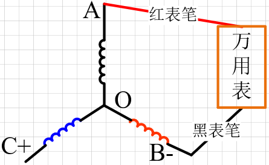
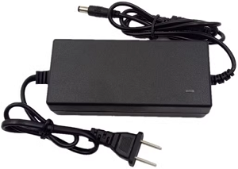
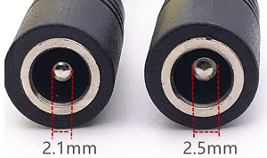

# 1.电机选型

电机型号：2312A(无点，正螺纹)，适用于大疆精灵3无人机无刷电机。

   

| 工作电压 | KV值 | 极对数 |相电阻|
| ---- | -------- | ------ |------ |
| 12V | 800    | 7      |待测量|

## 1.1 极对数判断

- 极对数：看转子上的磁铁个数，一般为2的倍数，极对数 = 转子磁铁个数 / 2。
- 使用直流电源进行测量：将电源电流限制到额定电流的10%左右，然后接电机的任意两相。用手抖动转子一周，有几次卡顿，极对数等于转动过程中卡顿的次数。

## 1.2 相电阻测量

使用万用表分别测量电机三相中的任意两相，然后取平均值，得到的为线电阻，之后需要再除以2即为相电阻值。

线电阻 = 2 * 相电阻

# 2.硬件电路设计

采用12V/5A的电源适配器进行供电，**输出DC公头接口：5.5\*2.5mm(兼容5.5\*2.1)**。

DC母头尺寸，

## 2.1 电源电路设计

### 2.1.1输入电源防反接电路

