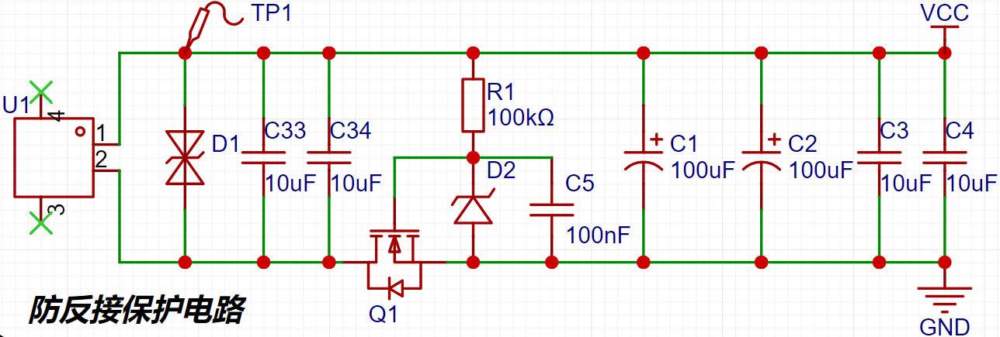

# 1.电机选型

电机型号：2312A(无点，正螺纹)，适用于大疆精灵3无人机无刷电机。

    

| 工作电压 | KV值 | 极对数 |相电阻|
| ---- | -------- | ------ |------ |
| 12V | 800    | 7      |待测量|

## 1.1 极对数判断

- 极对数：看转子上的磁铁个数，一般为2的倍数，极对数 = 转子磁铁个数 / 2。
- 使用直流电源进行测量：将电源电流限制到额定电流的10%左右，然后接电机的任意两相。用手抖动转子一周，有几次卡顿，极对数等于转动过程中卡顿的次数。

## 1.2 相电阻测量

使用万用表分别测量电机三相中的任意两相，然后取平均值，得到的为线电阻，之后需要再除以2即为相电阻值。

线电阻 = 2 * 相电阻

 

# 2.硬件电路设计

采用12V/5A的电源适配器进行供电，**输出DC公头接口：5.5\*2.5mm(兼容5.5\*2.1)**。

 

对应的DC母头尺寸：

 

## 2.1 电源电路设计

- TVS二极管选型：静电和浪涌保护，根据输入电源的参数，选择SMAJ12CA瞬态抑制二极管。

反向截止电压$V_{RWM}$：12V，击穿电压13.3V，最大钳位电压19.9V。

### 2.1.1输入电源防反接保护电路设计

 

- 电源正确接入时：在上电瞬间，通过NMOS的体二极管形成地回路。输入电源稳定之后，$V_{GS}$等于稳压二极管D2的稳压值12V(用于保护NMOS不被损坏)，此时NMOS完全导通，通过导电沟道$R_{DS(on)}$形成地回路。
- 电源反接时：NMOS的体二极管反向截止，$V_G=0V，V_S=0V，V_{GS}=0V$，不满足NMOS管的导通条件，此时无法形成地回路，进而实现输入电源防反接保护功能。
- 电容C1的作用：缓启动保护。

### 2.1.2 电源转换电路设计

- 系统中的工作电源需求：12V、3.3V

采用MT2492同步降压芯片，将12V输入电源转为3.3V电源。该芯片的主要工作参数如下所示：

1. 输入电压范围：4.5V~16V
2. 最大输出电流：2A
3. 参考电压：0.6V。工作频率：600KHz。最高能量转换效率：96%。

## 2.2 MCU最小系统电路设计

## 2.3 三相逆变电路设计

### 2.3.1 EG2133三相独立半桥驱动芯片

 

EG2133芯片特性：

- PWM工作频率最高为500KHz，兼容3.3V和5V的输入控制信号。
- 内置死区控制电路(100ns)，自带闭锁功能，可以避免单相桥臂中的上下MOS管同时导通。
- VCC输入电压范围：4.5V~20V。

### 2.3.2 三相逆变电路

 

- 采样电阻：0.01Ω，1206封装，功率1W，最大电流10A，所以工作电流要小于10A。

### 2.3.4 电流采样电路

使用STM32G4的内部运放进行电流采样，将其配置为独立工作模式，以无刷电机的A相电流采样为，

 

- R40和R41的作用：实现OPA的正向输入端和负向输入端阻抗匹配。
- R38和R39的作用：添加偏置电压1.65V。
  - **偏置电压的校准问题：电机未启动时，先测量1000次ADC的数据，然后取平均即为各相的偏置电压，不一定刚好为1.65V！**

运放增益计算：

$Gain=1+\dfrac {R_{42}}{R_{41}}=17.5$

运算放大器的ADC输出电压$U_{out}$计算公式：

$U_{out}=(I_{load}\times R_{shunt})Gain+U_{ref}=0.175I_{load}+1.65$

采样电流计算公式：

$U_{out}= \dfrac {ADC\_Value}{4096} \times 3.3$

$I_{load}= \dfrac {U_{out}-1.65}{0.175}$

$U_{out}$的最大值未3.3V，因此**最大采样电流为9.429A**。

### 2.3.5 三相电压采样电路

 

$U_{out}= \dfrac {U_{in}}{11}$，$U_{out}$最大为3.3V，因此最大采样电压为36.3V

### 2.3.5 母线电压&温度采样

 

## 2.4 MT6701编码器底板设计

径向磁铁型号：外径7mm，内径3mm，厚度3mm。购买链接：https://m.tb.cn/h.5roNT9v2M7mXlq4?tk=970pW8R1NOl 

