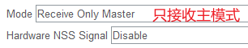
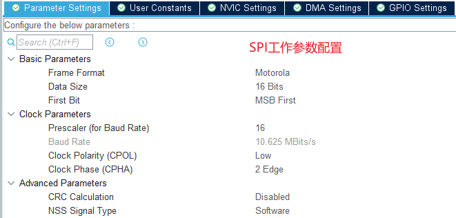
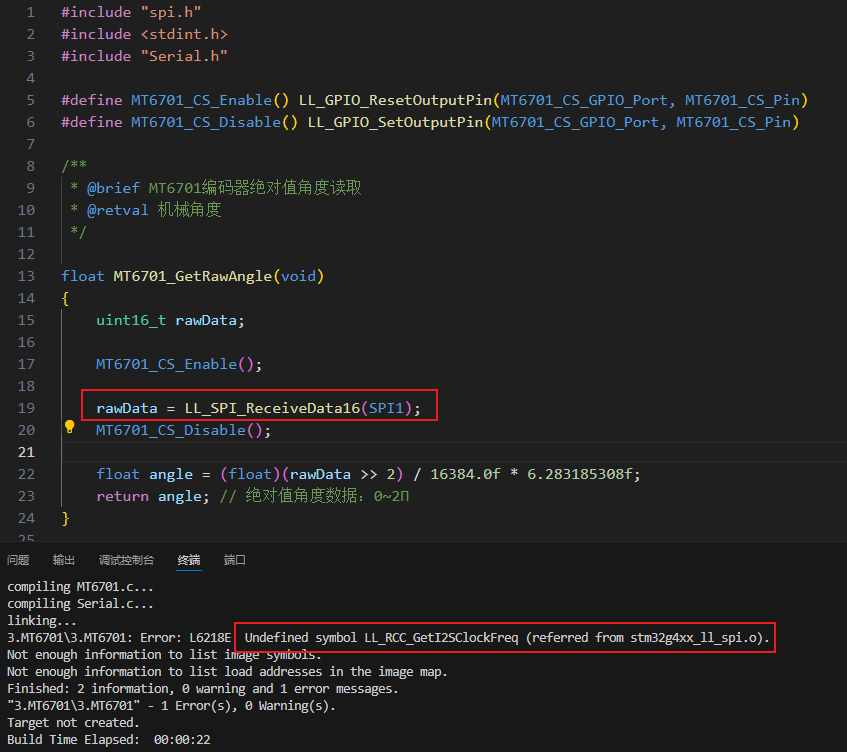
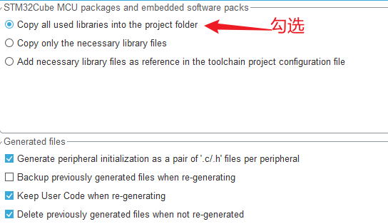

# 1. STM32CubeMX配置

 

 

| Pin Label  | Pin Name | Alternate Function(s) |
| ---------- | -------- | --------------------- |
| MT6701_CS  | PB9      | GPIO_Output           |
| MT6701_SCL | PB3      | SPI1_SCK              |
| MT6701_SDA | PB4      | SPI1_MISO             |

# 2. HAL库读取原始角度

```c
#include "spi.h"
#include <stdint.h>
#include "Serial.h"

#define MT6701_CS_Enable() HAL_GPIO_WritePin(MT6701_CS_GPIO_Port, MT6701_CS_Pin, GPIO_PIN_RESET)
#define MT6701_CS_Disable() HAL_GPIO_WritePin(MT6701_CS_GPIO_Port, MT6701_CS_Pin, GPIO_PIN_SET)

/**
 * @brief MT6701编码器绝对值角度读取
 * @retval 机械角度
 */
float MT6701_GetRawAngle(void)
{
    uint16_t rawData;

    MT6701_CS_Enable();

    HAL_StatusTypeDef spiStatus = HAL_SPI_Receive(&hspi1, (uint8_t *)&rawData, 1, HAL_MAX_DELAY);
    if (spiStatus != HAL_OK)
    {
        MT6701_CS_Disable();
        log_DMA_TX("MT6701 read data error!\r\n");
        return 0; // 在SPI传输错误时直接返回，避免继续执行后续代码
    }

    MT6701_CS_Disable();

    float angle = (float)(rawData >> 2) / 16384.0f * 6.283185308f;
    return angle; // 绝对值角度数据：0~2Π
}
```

# 3. LL库读取原始角度数据

状态指示：

- Tx buffer empty flag (TXE)：发送缓冲区为空
- Rx buffer not empty (RXNE)：接收缓冲区非空
- Busy flag (BSY)：SPI数据正在传输中

# 4. 注意事项

使用LL库进行SPI读取数据时，报错解决方法：

 

问题解决：

 

使用这个API读取传感器数据有些问题，读取到的值一直为0！

```c
    uint16_t rawData = LL_SPI_ReceiveData16(SPI1);
```

需要手动使能SPI
