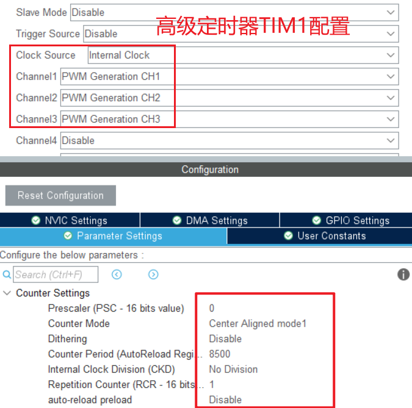

接下来使用C++和C混合的方式，采用Clion开发STM32项目。

# STM32CubeMX配置

设置PWM的工作频率为10K，预分频系数设为0，则ARR的值应为8500。

  

# SVPWM 中点平移法

```c
void setPhaseVoltage(float Uq, float Ud, float el_angle) {
    el_angle = _normalizeAngle(el_angle);

    // 待添加限制Uq范围的语句，Uq最大值等于Udc/sqrt(3)
    Uq = _constrain(Uq, -6.0f, 6.0f);
    Ud = _constrain(Ud, -6.0f, 6.0f);

    // Park逆变换
    float U_alpha = -Uq * arm_sin_f32(el_angle) + Ud * arm_cos_f32(el_angle);
    float U_beta = Uq * arm_cos_f32(el_angle) + Ud * arm_sin_f32(el_angle);

    // 将电压转换为百分比，便于PWM占空比计算
    U_alpha = U_alpha / Udc;
    U_beta = U_beta / Udc;

    // Clark逆变换
    float Ua = U_alpha;
    float Ub = -0.5f * U_alpha + 0.8660254f * U_beta;
    float Uc = -0.5f * U_alpha - 0.8660254f * U_beta;

    // 基于均值零序分量注入的SVPWM调制
    float Umax = findMax(&Ua, &Ub, &Uc);
    float Umin = findMin(&Ua, &Ub, &Uc);
    float Umid = -0.5f * (Umax + Umin);

    Ta = Ua + Umid;
    Tb = Ub + Umid;
    Tc = Uc + Umid;

    map_constraint(&Ta);
    map_constraint(&Tb);
    map_constraint(&Tc);

    // PWM输出
//    __HAL_TIM_SET_COMPARE(&htim1, TIM_CHANNEL_1, Ta * PWM_ARR);
//    __HAL_TIM_SET_COMPARE(&htim1, TIM_CHANNEL_2, Tb * PWM_ARR);
//    __HAL_TIM_SET_COMPARE(&htim1, TIM_CHANNEL_3, Tc * PWM_ARR);
    TIM1->CCR1 = Ta * PWM_ARR;
    TIM1->CCR2 = Tb * PWM_ARR;
    TIM1->CCR3 = Tc * PWM_ARR;
}
```

# 开环测试程序

```c
/**
 * @brief 开环运行测试
 * @note 虚拟一个电角度累加器
 * @param velocity 目标转速(rad/s)
 * @retval 无
 */
void open_velocity_test1(float velocity)
{
    static const float Uq = 2.0f;
    static const float Ud = 0.0f;

    static const float deltaT = 0.00625f;
    static float el_angle = 0.0f;

    el_angle = el_angle + velocity * deltaT; // 电角度累加器

    setPhaseVoltage(Uq, Ud, el_angle);
}
```

