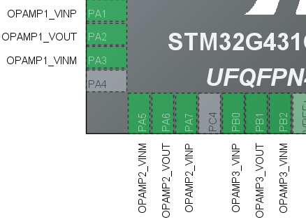
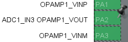

# STM32G431内部运放使用

OPA工作模式：

- 独立模式：运放的增益通过外部电阻进行配置，比较常用！
- 跟随模式：很少使用
- 可编程增益模式：运放的增益可以通过软件进行修改，如果对运放的增益没有明确的需求，可以使用这种模式。

STM32CubeMX配置：

(1)使能OPA：配置为独立模式，参数保持默认即可。

 

(2)将OPA的输出与ADC进行级联，以OPA1为例进行配置：

 

