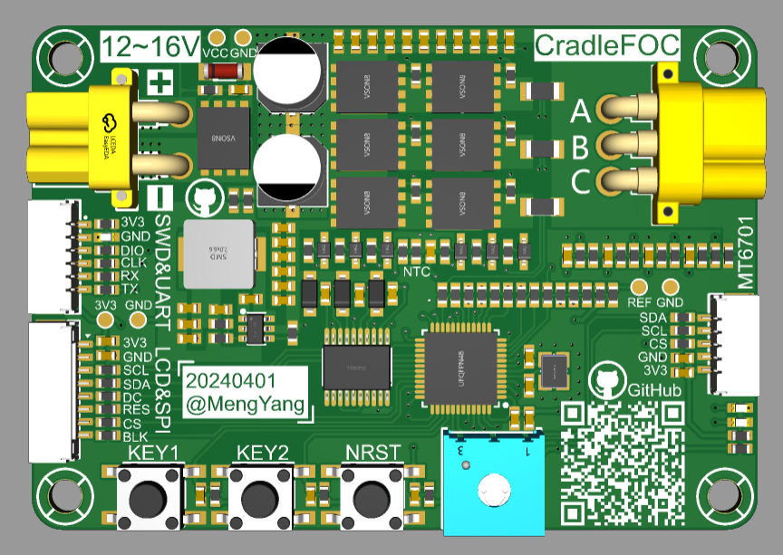
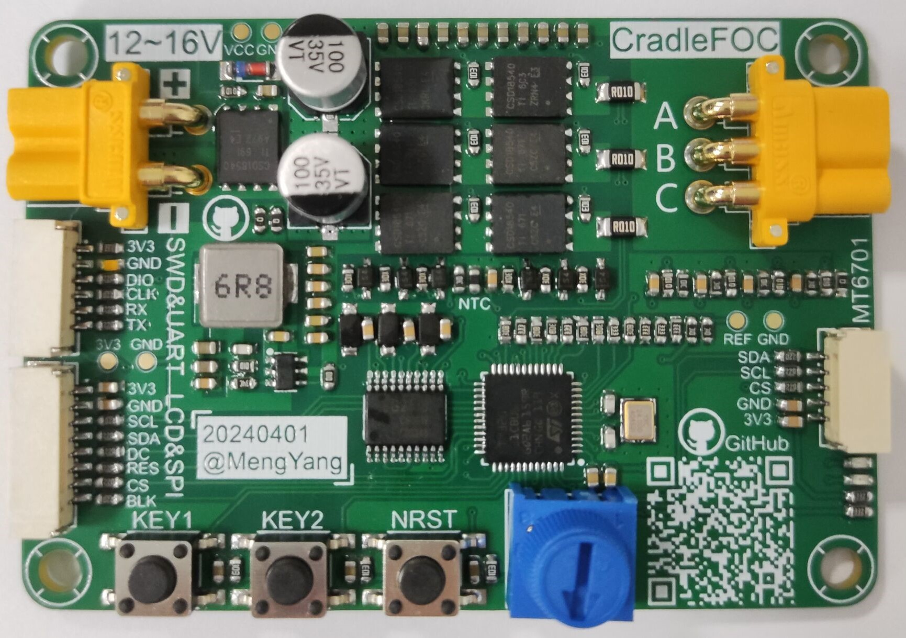
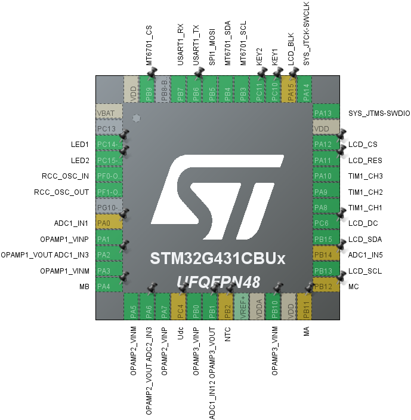

# 项目开发LOG

- [ ] 20224年3月23日：立项，中文名“摇篮FOC”，英文名“CradleFOC”。
- [ ] 2024年3月24日：开始设计CradleFOC硬件原理图。
- [ ] 2024年3月28日：完成CradleFOC硬件原理图设计。
- [ ] 2024年3月29日：进行PCB Layout。
- [ ] 2024年4月1日：完成PCB Layout。
- [ ] 2024年4月7日：焊接测试完毕。

# 1. CradleFOC简介

  

 

- 主控：STM32G431CBU6，晶振24MHz，通过时钟分频倍频配置，设置MCU的工作频率为170MHz。

- 电流采样电阻0.01Ω，1206封装，功率1W，最大电流10A，所以工作电流要小于10A。
- 三相电流采样，采用MCU内部的OPA运放，进一步减小设计成本。

# 2. 工作电源

**采用12V/5A的电源适配器进行供电，本次项目所设计的硬件电路，最大输入电源不应超过16V/9A！**

# 3. GPIO分配

STM32CubeMX引脚配置图：

  

## 3.1 SWD&USART引脚

| Pin Label | Pin Name | Alternate Function(s) |
| --------- | -------- | --------------------- |
| SWDIO     | PA13     | SWD                   |
| SWCLK     | PA14     | SWD                   |
| TX        | PB6      | USART1                |
| RX        | PB7      | USART1                |

## 3.2 PWM输出引脚

| Pin Label | Pin Name | Alternate Function(s) |
| --------- | -------- | --------------------- |
| IN1       | PA8      | TIM1_CH1              |
| IN2       | PA9      | TIM1_CH2              |
| IN3       | PA10     | TIM1_CH3              |

## 3.2 电流采样ADC引脚分配

| Pin Label | Pin Name | Alternate Function(s) |
| --------- | -------- | --------------------- |
| IA        | PA2      | ADC1_IN3              |
| IB        | PA6      | ADC2_IN3              |
| IC        | PB1      | ADC1_IN12             |

## 3.3 电压采样

| Pin Label | Pin Name | Alternate Function(s) |
| --------- | -------- | --------------------- |
| MA        | PB11     | ADC1_IN14             |
| MB        | PA4      | ADC2_IN17             |
| MC        | PB12     | ADC1_IN11             |
| VCC       | PC4      | ADC2_IN5              |

## 3.4 MOS管温度采样

| Pin Label | Pin Name | Alternate Function(s) |
| --------- | -------- | --------------------- |
| NTC       | PB2      | ADC2_IN12             |

## 3.5 电位器调速控制

| Pin Label | Pin Name | Alternate Function(s) |
| --------- | -------- | --------------------- |
| POT       | PA0      | ADC1_IN1、ADC2_IN1    |

## 3.6 按键控制

| Pin Label | Pin Name | Alternate Function(s) |
| --------- | -------- | --------------------- |
| NRST      | PG10     | 复位按键              |
|KEY1|PC10|GPIO_EXTI10|
|KEY2|PC11|GPIO_EXTI11|

## 3.7 LCD接口

| Pin Label | Pin Name | Alternate Function(s) |
| --------- | -------- | --------------------- |
| LCD_SDA   | PB15     | SPI2_MOSI             |
| LCD_SCL   | PB13     | SPI2_SCK              |
| LCD_DC    | PC6      | GPIO_Output           |
| LCD_RES   | PA11     | GPIO_Output           |
| LCD_CS    | PA12     | GPIO_Output           |
| LCD_BLK   | PA15     | GPIO_Output           |

## 3.8 MT6701编码器接口

| Pin Label  | Pin Name | Alternate Function(s) |
| ---------- | -------- | --------------------- |
| MT6701_CS  | PB9      | GPIO_Output           |
| MT6701_SCL | PB3      | SPI1_SCK              |
| MT6701_SDA | PB4      | SPI1_MISO             |

## 3.9 信号指示灯

外部上拉，低电平点亮。

| Pin Label | Pin Name | Alternate Function(s) |
| --------- | -------- | --------------------- |
| LED1      | PC14     | GPIO_Output           |
| LED2      | PC15     | GPIO_Output           |

# 4.注意事项

1. GH1.25的连接线，如果使用本项目的相关配件，需要购买反向线序的连接线。如果购买同向的连接线，需要手动更改端子的线序。
